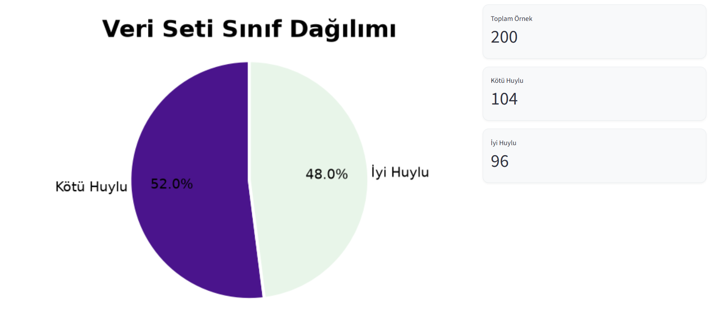
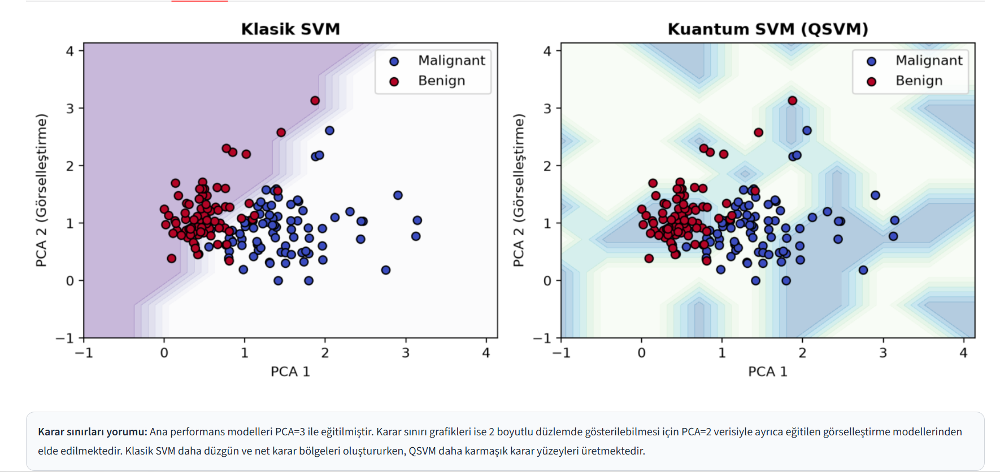
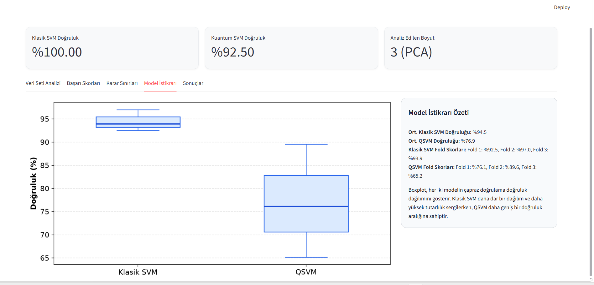
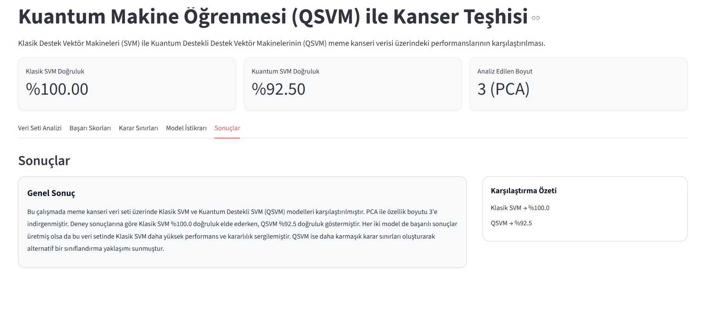

# QSVM Kanser Teşhisi

Bu proje, Wisconsin Meme Kanseri Veri Seti üzerinde Klasik Destek Vektör Makineleri (SVM) ile Kuantum Destekli Destek Vektör Makinelerinin (QSVM) performanslarını karşılaştırmak amacıyla geliştirilmiş bir Streamlit uygulamasıdır. Çalışma, kuantum makine öğrenmesi yöntemlerinin tıbbi veri sınıflandırma problemlerindeki uygulanabilirliğini incelemektedir. `app.py` ana giriş dosyası olarak kalır ve uygulama, kuantum makine öğrenmesi yaklaşımını görselleştirir.

## Ana Sayfa

<p align="center">
  
</p>

## Kullanılan Teknolojiler

- Python
- Streamlit
- NumPy
- Matplotlib
- Scikit-Learn
- Qiskit
- Qiskit Machine Learning

## Kurulum

1. Depoyu klonlayın:
   ```bash
   git clone <repository-url>
   cd "bitirmeB final"
   ```
2. Sanal ortam oluşturun:
   ```bash
   python -m venv venv
   ```
3. Ortamı etkinleştirin:
   - Windows:
     ```bash
     .\venv\Scripts\activate
     ```
   - macOS/Linux:
     ```bash
     source venv/bin/activate
     ```
4. Bağımlılıkları yükleyin:
   ```bash
   pip install -r requirements.txt
   ```

## Çalıştırma

Ana uygulamayı başlatmak için:

```bash
streamlit run app.py
```

`app.py` projenin ana giriş noktasıdır.

> Not: `main.py` ayrıca grafik ve karar sınırı çıktıları üretmek için kullanılabilir.

## Elde Edilen Sonuçlar

- Klasik SVM Test Doğruluğu: %100
- QSVM Test Doğruluğu: %92.5
- 3 Katlı Çapraz Doğrulama
  - Klasik SVM Ortalama: %94.5
  - QSVM Ortalama: %76.9

## Ekran Görüntüleri

### ana-sayfa.png


### veri-seti.png


### karar-sinirlari.png


### model-istikrari.png


### sonuclar.png


## Proje Yapısı

Önerilen final sürümünde klasör yapısı şu şekilde olabilir:

- `app.py` – Ana Streamlit uygulaması
- `main.py` – Ek hesaplamalar ve karar sınırı görselleştirmeleri için yardımcı betik
- `requirements.txt` – Proje bağımlılıkları
- `.gitignore` – Git için yok sayılacak dosyalar
- `README.md` – Proje tanıtımı ve kullanım bilgileri
- `COMPLETION_REPORT.md` – Proje teslim belgesi veya rapor dosyası

### Önerilen düzenli klasör yapısı

- `app.py`
- `main.py`
- `requirements.txt`
- `.gitignore`
- `README.md`
- `COMPLETION_REPORT.md`
- `screenshots/` (isteğe bağlı, görseller için)

## Açıklama

Bu proje, klasik SVM ve QSVM modellerinin meme kanseri verisi üzerindeki performansını karşılaştırmak için hazırlanmıştır. `app.py`, kullanıcı dostu bir akışta hesaplama ve görselleştirme adımlarını sunar.
